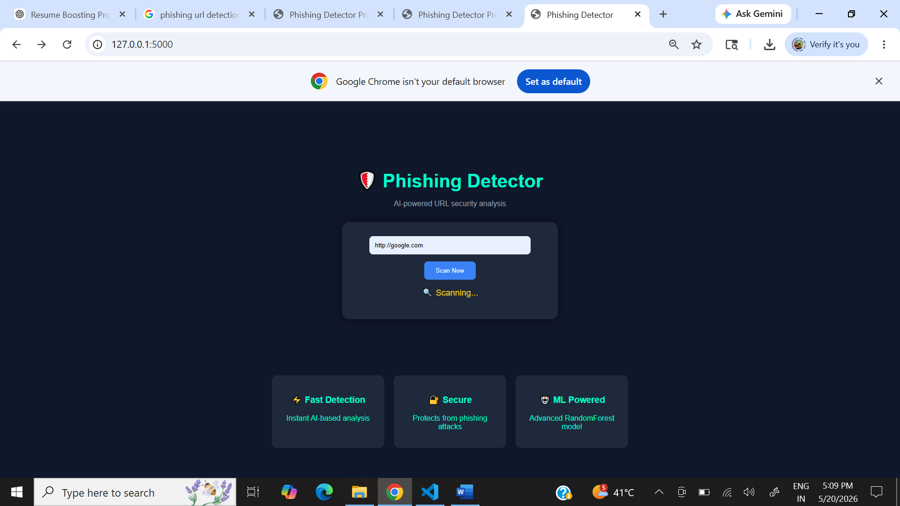

# 🔐 Phishing URL Detector

A machine learning-based web app to detect phishing URLs.

## 🚀 Features
- ML model (Random Forest)
- Feature extraction
- Hacker-style UI
- Real-time URL input

## 🛠️ Tech Stack
- Python
- Flask
- HTML/CSS
- Scikit-learn

## ▶️ Run Locally
```bash
pip install -r requirements.txt
python app.py

## 📸 Screenshot


